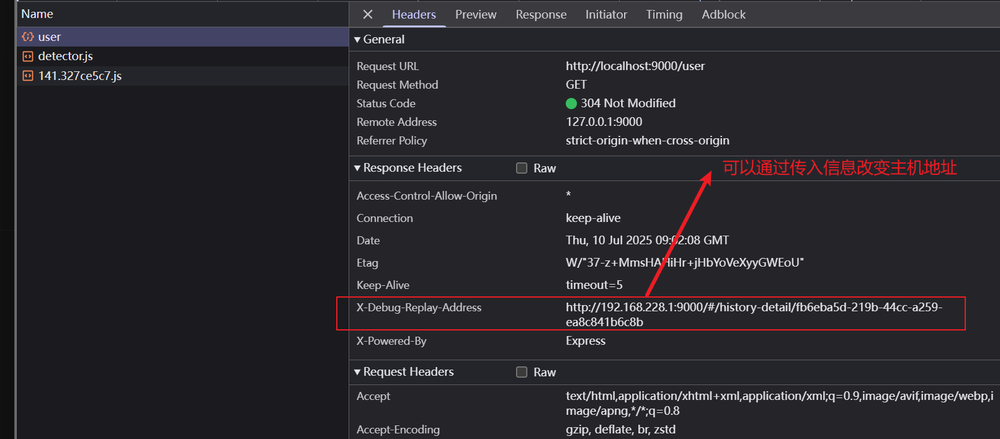

# 历史记录

对请求进行拦截，并生成记录。不对文件上传接口进行拦截，如果对文件上传接口拦截会导致生成的记录文件过大。

用于和[代理](./proxy.md)搭配使用，可以实现重新请求，直接点击按钮重新请求。在与后端联调时会很有用，因为在开发的过程中，如果服务端出现bug，就需要前后端进行联调，去找问题。由于数据每次都是手动填写的会耽误时间。通过这个工具进行代理，会请求接口进行记录，通过按钮点击一键发送请求

## enableHistory

类型: `boolean`

配置项，默认开启可以关闭。

## 查看记录

点击`web`页面上的`history`导航查看记录，点击详情可以重新发送请求。

```ts
import { defineConfig } from './dist'

export default defineConfig({
 server: {
   db: {
      user: [
        {
          id: 1,
          name: '张三'
        },
        {
          id: 2,
          name: '李四'
        }
      ]
    }
 }
})
```


## 搭配代理使用

经过`asrv`的请求都会被拦截，生成历史记录，并且在返回数据时在response通过`X-Debug-Replay-Address`字段，获取replay详情链接，用于发送请求。

```ts
import { defineConfig } from './dist'

export default defineConfig({
  proxy: {
    '/api': {
      target: 'http://localhost:3000/api',
      changeOrigin: true,
    },
  },
})
```

`X-Debug-Replay-Address`： 字段上面有演示

用于无法获知那一条主机地址可以被其它局域网设备访问，可以传入`historyResHost`，使得返回的`X-Debug-Replay-Address`能够被其它设备访问。

```ts
import { defineConfig } from './dist'

export default defineConfig({
  proxy: {
    '/api': {
      target: 'http://localhost:3000/api',
      changeOrigin: true,
    },
  },
  historyResHost: '192.168.1.10'
})
```

