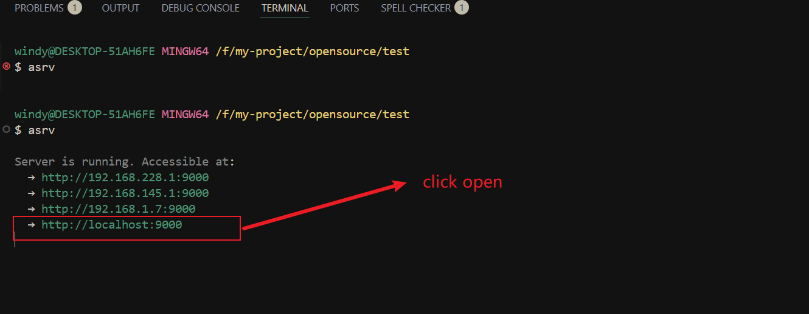
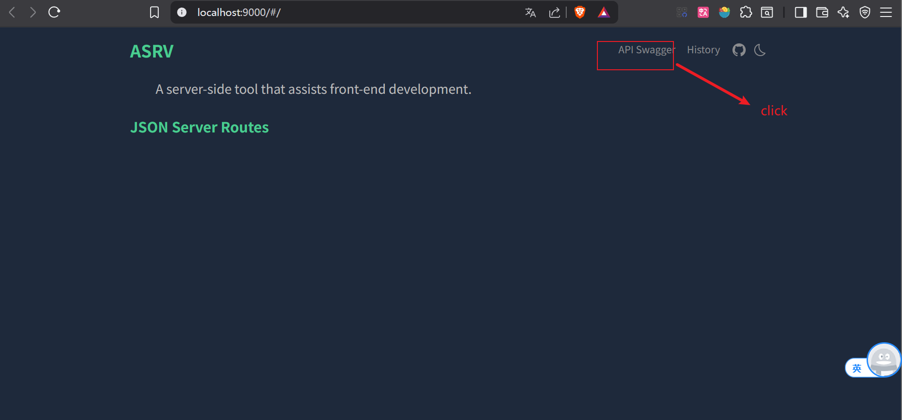
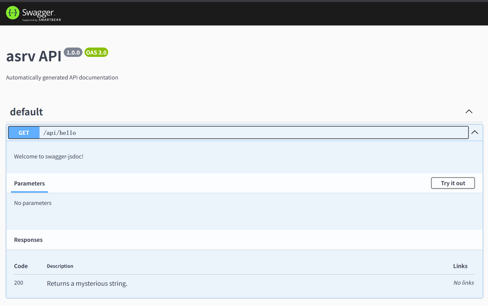

# Swagger

使用[swagger-jsdoc](https://github.com/Surnet/swagger-jsdoc)和[swagger-ui](https://github.com/swagger-api/swagger-ui)来生成swagger文档。

## 基本使用

```ts
import { defineConfig } from 'asrv'

export default defineConfig({
  port: 9000,
  server: {
    api: {
      /**
       * @openapi
       * /api/hello:
       *   get:
       *     description: Welcome to swagger-jsdoc!
       *     responses:
       *       200:
       *         description: Returns a mysterious string.
       */
      '/api/hello': 'hello world',
    },
  },
})
```

点击打开web页面，点击swagger导航查看详情




