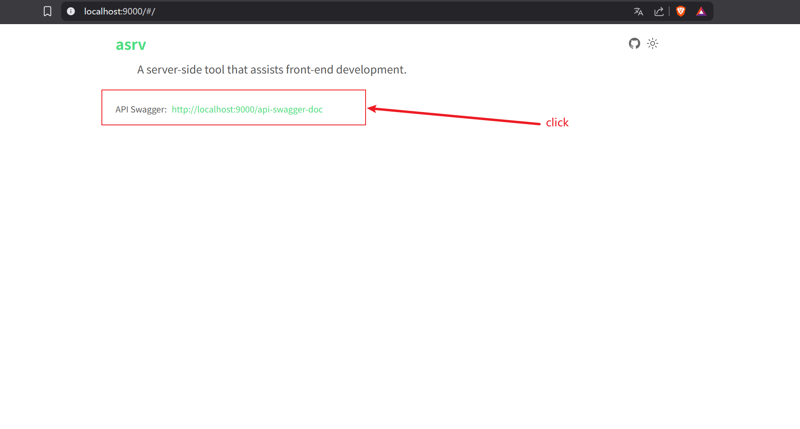
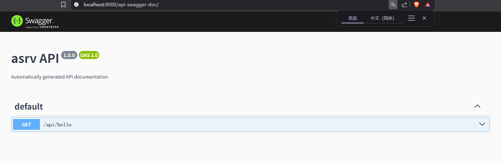

# asrv

[](https://github.com/typicode/json-server/actions/workflows/node.js.yml)

一个开发助手服务，结合了[Mockjs](http://mockjs.com/)和[json-server](https://github.com/typicode/json-server)快速生成符合REST API规范接口。

快速定义接口能够获取数据，对数据进行操作。

## 特性

- 添加了mock功能，使用mockjs生成数据
- 添加了json-server功能，使用json-server生成`REST API`规范接口
- 可以对json-server输出的结果进行拦截，从而达到接口返回的结果与日常使用数据一致
- 添加了代理功能，而且代理配置与vite代理配置一致
- 集成了swagger，可以通过swagger注释生成接口文档
- 添加日志功能

## 安装
```shell
npm install asrv -D
```
## 使用

创建一个`asrv.config.js`或者`asrv.config.ts`文件，导出了`defineConfig`提供了更好配置体验。

下面的案例结合了mockjs和json-server的基础使用，更多mockjs的使用方法请查看[mockjs](http://mockjs.com/)，jonson-server用法请查看[json-server](https://github.com/typicode/json-server)

```ts
import { defineConfig, mock } from 'asrv'

export default defineConfig({
  port: 9000,
  server: {
    db: {
      user: [
        {
          id: 1,
          name: '张三'
        },
        {
          id: 2,
          name: '李四'
        }
      ]
    }
  },
})
```

在控制台使用CLI，默认会查询项目根目录的`asrv.config.js/asrv.config.ts/asrv.config.mjs`等文件。

```bash
npx asrv
```

指定配置文件
```bash
npx asrv -c ./config.js
```

在`package.json`中添加脚本

```json
{
  "scripts": {
    "server": "asrv" // or "asrv -c ./config.js"
  }
}
```

```shell
# 生成了REST API接口
$ curl http://localhost:9000/user
[
  {
    "id": 1,
    "name": '张三'
  },
  {
    "id": 2,
    "name": '李四'
  }
]
```

### 搭配mock基础使用
```ts
// asrv.config.ts
import { defineConfig, mock } from 'asrv'

export default defineConfig({
  port: 9000,
  server: {
    // mock数据, 自动生成接口
    db: mock({
      'user|3-5': [
        {
          id: '@guid',
          name: '@cname',
          email: '@email',
          address: '@county(true)',
          phone: '@phone',
        },
      ],
      'posts|3-5': [
        {
          id: '@guid',
          title: '@ctitle',
          content: '@cparagraph',
          author: '@cname',
          date: '@date',
        },
      ],
    })
  },
})
```

```shell
$ curl http://localhost:9000/user
[
    {
        "id": "BD9d311f-da1d-dF4D-45fb-3bF94EfB9EF2",
        "name": "蔡平",
        "email": "e.myncqsrhr@hhltw.nr",
        "address": "广西壮族自治区 百色市 那坡县",
        "phone": "18728635647"
    },
    {
        "id": "7bA7CC76-C6A7-1f4c-FD8B-aCE299A0E2fb",
        "name": "张娟",
        "email": "f.dwjajthg@jogpmks.bw",
        "address": "湖北省 随州市 广水市",
        "phone": "18476018723"
    },
    {
        "id": "f30FEd58-bbbf-5bCC-33BE-94066C93F4B6",
        "name": "田艳",
        "email": "t.nvwucdonj@jdaqxl.ml",
        "address": "四川省 凉山彝族自治州 会理县",
        "phone": "18010322709"
    },
]
```

#### 使用重定向配置为json-server的接口添加`api`前缀

```ts
// asrv.config.ts
import { defineConfig, mock } from 'asrv'

export default defineConfig({
  port: 9000,
  server: {
    // 重定义向为接口添加前缀, 重api过来的接口会将api前缀去掉
    redirectApiPrefixes: [
      {
        from: '/api',
        to: '',
      },
    ],
    // mock数据, 自动生成接口
    db: mock({
      'user|3-5': [
        {
          id: '@guid',
          name: '@cname',
          email: '@email',
          address: '@county(true)',
          phone: '@phone',
        },
      ],
      'posts|3-5': [
        {
          id: '@guid',
          title: '@ctitle',
          content: '@cparagraph',
          author: '@cname',
          date: '@date',
        },
      ],
    }),
  },
})
```

```shell
$ curl http://localhost:9000/api/user
[
  {
  "id": "DD1B9B5d-c65f-BBDE-661E-e91b4EA7D85E",
  "name": "高秀英",
  "email": "t.bgctw@uqjfusmul.ht",
  "address": "黑龙江省 佳木斯市 富锦市",
  "phone": "17331264518"
  },
  {
  "id": "ECADE614-0bFE-a9b6-df3a-6c4934EC414d",
  "name": "易霞",
  "email": "k.xsxnx@gucgteyncj.ma",
  "address": "浙江省 杭州市 下城区",
  "phone": "13812227134"
  },
  {
  "id": "E98bc4cd-b17D-c3E7-9725-bBF3Aa3c9B2a",
  "name": "赵平",
  "email": "r.jwok@olbq.mn",
  "address": "甘肃省 定西市 渭源县",
  "phone": "18577041233"
  }
]
```

#### 对JsonServer的结果进行拦截，使接口返回为常用形式

非必要部分被省略， 接口mock和重定向，与上面一致

```ts
import { defineConfig, mock } from 'asrv'

export default defineConfig({
  port: 9000,
  server: {
    jsonServerResponseInterceptor(req, res) {
      const { data } = res.locals

      if (data === undefined) {
        res.json({
          code: -404,
          message: '数据不存在',
        })
      }
      else {
        if (req.method === 'POST') {
          res.json({
            code: 0,
            message: '添加成功',
          })
        }
        else if (req.method === 'DELETE') {
          res.json({
            code: 0,
            message: '删除成功',
          })
          // ... 其它自行判断
        }
        else {
          res.json({
            code: 0,
            message: '查询成功',
            data,
          })
        }
      }
    },
  },
})
```
```shell
$ curl http://localhost:9000/api/user

{
"code": 0,
"message": "查询成功",
"data": [
    {
      "id": "2F28d39d-2EEd-4a21-b8e8-26a2FAdF51e7",
      "name": "曾军",
      "email": "c.fmxertfaj@cqgb.gw",
      "address": "湖北省 黄石市 铁山区",
      "phone": "14543167560"
    },
    {
      "id": "7dCC714E-ceC0-d815-c48C-9cb3659dd5BF",
      "name": "蒋勇",
      "email": "k.jdoscp@wwelnt.ge",
      "address": "河南省 许昌市 鄢陵县",
      "phone": "13730245562"
    },
    {
      "id": "F27ABdcB-1Ab6-c37f-d7f1-DcB4d1Bf3C15",
      "name": "董平",
      "email": "g.xppyg@opdk.is",
      "address": "浙江省 台州市 三门县",
      "phone": "17497495282"
    }
  ]
}
```

delete请求操作，返回拦截后的数据

```shell
$ http DELETE http://localhost:9000/api/user/F27ABdcB-1Ab6-c37f-d7f1-DcB4d1Bf3C15

{
    "code": 0,
    "message": "删除成功"
}
```

post请求操作

```shell
$ http POST http://localhost:9000/api/user name=windyeasy email=test@qq.com address=testAddress phone=123456789

{
    "code": 0,
    "message": "添加成功"
}
```

### 定义接口（API配置项使用）

#### 基础使用

```ts
import { defineConfig } from 'asrv'

export default defineConfig({
  port: 9000,
  server: {
    api: {
      api: {
        'user': {
        //  接口地址：/api/user/detail, 这样定义相当于：`get detail`
          'detail': '用户详情',
          // 可以设置请求方式，并且可以通过JSON.stringify()返回json数据
          'post add': JSON.stringify({
            code: 0,
            message: '添加成功',
          }),
        },
        'posts/list': JSON.stringify({
          code: 0,
          message: '获取列表成功',
          data: [
            { id: 1, title: '文章1' },
            { id: 2, title: '文章2' },
            { id: 3, title: '文章3' },
          ],
        }),
      },
    },
  },
})
```

```shell
$ curl http://localhost:9000/api/user/detail
用户详情
```

```shell
$ http POST http://localhost:9000/api/user/add

{
    "code": 0,
    "message": "添加成功"
}
```

```shell
$ curl http://localhost:9000/api/posts/list
{
  "code": 0,
  "message": "获取列表成功",
  "data": [
    {
      "id": 1,
      "title": "文章1"
    },
    {
      "id": 2,
      "title": "文章2"
    },
    {
      "id": 3,
      "title": "文章3"
    }
  ]
}
```

#### 使用的中间件函数

支持单个，并且支持通过数组传入多个中间件函数

```ts
import { defineConfig } from 'asrv'

export default defineConfig({
  port: 9000,
  server: {
    api: {
      api: {
        // 中间件基础使用
        'post posts/add': function (_, res) {
          res.json({
            code: 0,
            message: '帖子创建成功',
          })
        },
        // 通过数组传入数组传入中间件
        'post login': [
          function (req, res, next) {
            const body = req.body
            if (body.username === 'admin' && body.password === 'admin') {
              next()
            }
            else {
              // 提前提示错误
              res.json({
                code: -101,
                message: '用户名或密码错误',
              })
            }
          },
          function (_, res) {
            res.json({
              code: 0,
              message: '登录成功',
            })
          },
        ],
      },
    },
  },
})
```

增加添加帖子的接口演示

```shell
$ http POST http://localhost:9000/api/posts/add

{
    "code": 0,
    "message": "帖子创建成功"
}
```

测试多个中间件的使用方法

没有通过验证

```shell
$ http POST http://localhost:9000/api/login username=test password=123456

{
    "code": -101,
    "message": "用户名或密码错误"
}
```

#### 使用`useData`

可以与JSONServer的数据结合使用，提供一个`useData`获取数据

```ts
import { defineConfig, useData } from 'asrv'

interface DBType {
  user: {
    id: number
    name: string
  }[]
}
export default defineConfig({
  port: 9000,
  server: {
    db: {
      user: [
        {
          id: 1,
          name: 'windyeasy',
        },
        {
          id: 2,
          name: 'xiaoming',
        },
      ],
    },
    api: {
      api: {
        'delete user/remove/:id': async function (req, res) {
          const { id } = req.params
          // 传入泛型，提供更好的类型提示
          const [data, setData] = await useData<DBType>(req)
          const index = data.user.findIndex(item => item.id === +id)
          data.user.splice(index, 1)
          await setData(data)
          res.json({
            code: 200,
            message: '删除成功',
          })
        },
      },
    },
  },
})
```

查看原始数据

```shell
curl http://localhost:9000/user
[
  {
    "id": "1",
    "name": "windyeasy"
  },
  {
    "id": "2",
    "name": "xiaoming"
  }
]
```

调用删除接口，并验证数据

```shell
$ http DELETE http://localhost:9000/api/user/remove/2

{
    "code": 200,
    "message": "删除成功"
}
```

验证数据

```shell
$ curl http://localhost:9000/user

[
  {
    "id": "1",
    "name": "windyeasy"
  }
]
```

#### swagger的使用

```ts
import { defineConfig } from 'asrv'

export default defineConfig({
  port: 9000,
  server: {
    api: {
      /**
       * @openapi
       * /api/hello:
       *   get:
       *     description: Welcome to swagger-jsdoc!
       *     responses:
       *       200:
       *         description: Returns a mysterious string.
       */
      '/api/hello': 'hello world',
    },
  },
})
```

可以点击打开脚手架展示连接：http://localhost:9000，有一个页面展示swgger的地址





### 日志使用

日志功能默认是关闭的，需要打开。打开文件日志会创建一个日志文件，放在`/asrv/logs/`目录下

```ts
import { defineConfig } from 'asrv'

export default defineConfig({
  port: 9000,
  logger: {
    // 开启日志，默认并开启控制台日志
    enable: true,
    // 开启文件日志
    enableFile: true,
  },
  server: {
    api: {
      /**
       * @openapi
       * /api/hello:
       *   get:
       *     description: Welcome to swagger-jsdoc!
       *     responses:
       *       200:
       *         description: Returns a mysterious string.
       */
      '/api/hello': 'hello world',
    },
  },
})
```

### 分模块使用

当需要定义的接口数量过多时不利于维护，建议将接口定义在多个模块中，提供的`defineServerConfig`和`defineApiConfig`, 支持更好的提示

```ts
// asrv/api.ts
import { defineApiConfig } from 'asrv'

export default defineApiConfig({
  frontapi: {
    user: '用户列表',
    posts: '文章列表',
  },
})
```

提供了`$deps`配置传入依赖文件，当文件发生修改时，会自动重启服务，为什么要使用配置呢？

- 由于监听当前项目的所有文件发生修改，可能会导致性能问题，过程因此建议使用配置文件来监听文件修改

```ts
// asrv.config.ts

import { defineConfig } from 'asrv'
import frontApi from './asrv/api'

export default defineConfig({
  port: 9000,
  // 定义依赖文件, 支持文件通配符，当依赖文件变化时，重启服务
  $deps: ['./asrv/*.ts'],
  server: {
    api: {
      // 使用模块进行扩展
      ...frontApi,
    },
  },
})
```

提供了`defineServerConfig`方法，可以将`server`配置项使用其他模块进行设置

### 代理功能使用

与`vite`的代理配置基本一致，注意：当定义了接口与接口名称相同时，请求优先使用定义的，如果需要关闭定义的接口请使用`enableServer`配置

```ts
import { defineConfig } from './dist'

export default defineConfig({
  port: 9000,

  proxy: {
    '/api': {
      target: 'http://localhost:3000/api',
      changeOrigin: true,
    },
  },
  // 当为false, server定义的接口将不会启用
  enableServer: true,
  server: {
    api: {
      api: {
        '/api/user': 'user'
      }
    },
  },
})
```

## TODO

- [ ] client-plugin
  - [x] 描述
  - [ ] 展示所有接口
  - [x] 使用vue开发页面
- [x] 允许局域网访问
- [ ] server-plugin
  - [x] 将代理接口重定向，jonserver: 无需在写接口
  - [x] json-server
  - [x] json-server拦截器-由拦截器进行返回
  - [x] 为API添加swagger
  - [x] 输出json-server接口接地址
  - [ ]  ws处理

- [x] 日志功能
- [x] 添加MOCK函数
- [x] proxy提示
- [x] defineServerConfig
- [x] defineApiConfig
- [x] 接口定义处理
  - [x] useData不放在中间件中
  - [x] 定义接口时可以传入多个中间件
  - [x] 日志功能从新定义
    - [x] 默认值false
    - [x] level 默认info
- [x] 数据持久化
- [ ] history
  - [x] 对所有请求的数据进行缓存，可以在页面上显示，支持重新请求
  - [ ] auto-remove
    - [ ] 缓存时间
  - [ ] 先不考虑文件上传接口
- [ ] readme
- [ ] doc

- [ ]  文档流
  - [ ] 上传文件，有一个配置缓存位置
  - [ ] 使用默认文件，通过接口返回文件，模拟文件下载
- [ ] 加载静态资源

## License

[MIT](./LICENSE) License © [windyeasy](https://github.com/windyeasy)
